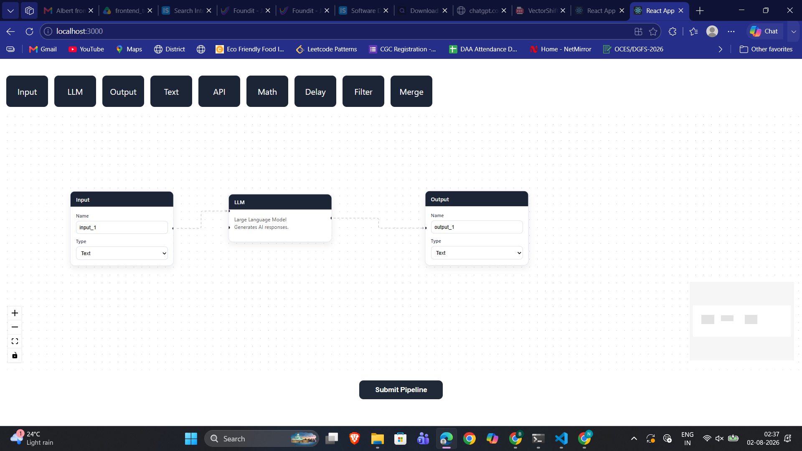
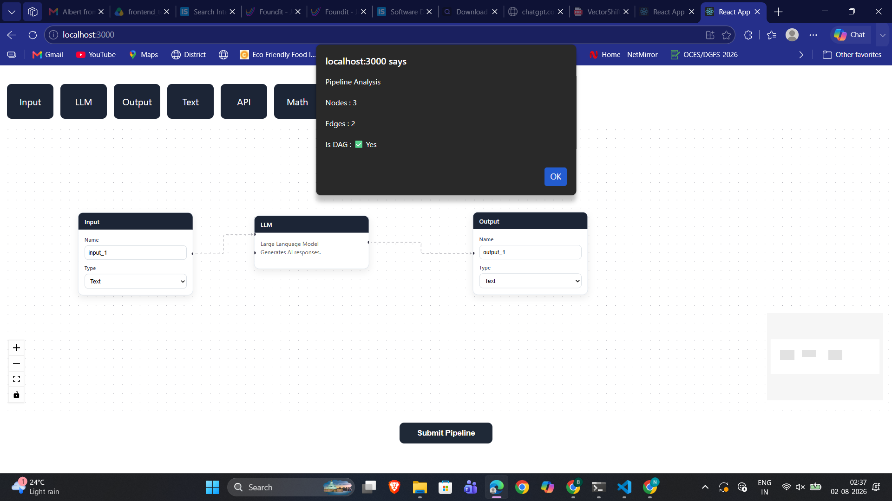

# 🚀 VectorShift Workflow Builder

A drag-and-drop workflow builder developed as part of the **VectorShift Frontend Technical Assessment**.

The application allows users to visually build pipelines, dynamically generate node inputs from text variables, and analyze workflows using a FastAPI backend.

---

# ✨ Features

- Reusable **BaseNode** abstraction
- 9 workflow node types
- Drag-and-drop workflow editor using React Flow
- Dynamic Text Node supporting `{{variable}}` syntax
- Automatic input handle generation
- Auto-resizing Text Node
- FastAPI backend integration
- Pipeline analysis
- DAG (Directed Acyclic Graph) detection using **Kahn's Algorithm**
- Responsive and reusable component architecture

---

# 🛠 Tech Stack

## Frontend

- React
- React Flow
- Zustand
- Axios

## Backend

- FastAPI
- Python

---

# 📂 Project Structure

```text
vectorshift-workflow-builder/
│
├── backend/
│   └── main.py
│
├── frontend/
│   ├── src/
│   └── public/
│
├── photo/
│   ├── 1.png
│   └── 2.png
│
└── README.md
```

---

# 🏗 Architecture

```text
                React
                  │
                  ▼
            React Flow
                  │
                  ▼
               Zustand
                  │
                  ▼
                Axios
                  │
                  ▼
        FastAPI Backend
                  │
                  ▼
         Pipeline Analysis
                  │
      ┌───────────┼───────────┐
      │           │           │
      ▼           ▼           ▼
 Node Count   Edge Count   DAG Detection
```

---

# 🧠 Algorithm Used

Pipeline cycle detection is implemented using **Kahn's Algorithm (Topological Sorting)**.

### Time Complexity

```
O(V + E)
```

### Space Complexity

```
O(V + E)
```

where

- **V** = Number of Nodes
- **E** = Number of Edges

---

# ⚙ Installation

## Backend

```bash
cd backend
pip install fastapi uvicorn python-multipart
uvicorn main:app --reload
```

Runs on:

```
http://127.0.0.1:8000
```

---

## Frontend

```bash
cd frontend
npm install
npm start
```

Runs on:

```
http://localhost:3000
```

---

# 📸 Screenshots

## Workflow Builder



---

## Pipeline Analysis



---

# 🔤 Dynamic Text Node

The Text Node supports variables using the syntax

```text
{{variable}}
```

Example

```text
Hello {{name}}

Welcome {{company}}

Email {{email}}
```

Each detected variable automatically creates an input handle on the left side of the node.

---

# 📊 Backend Analysis

When the user clicks **Submit Pipeline**, the frontend sends the workflow graph to the FastAPI backend.

The backend calculates:

- Number of Nodes
- Number of Edges
- Whether the graph is a DAG

Example response

```json
{
  "num_nodes": 3,
  "num_edges": 2,
  "is_dag": true
}
```

---

# 👨‍💻 Author

**Bharath L**

MIT License

Copyright (c) 2026 Bharath L

Permission is hereby granted, free of charge, to any person obtaining a copy
of this software and associated documentation files...